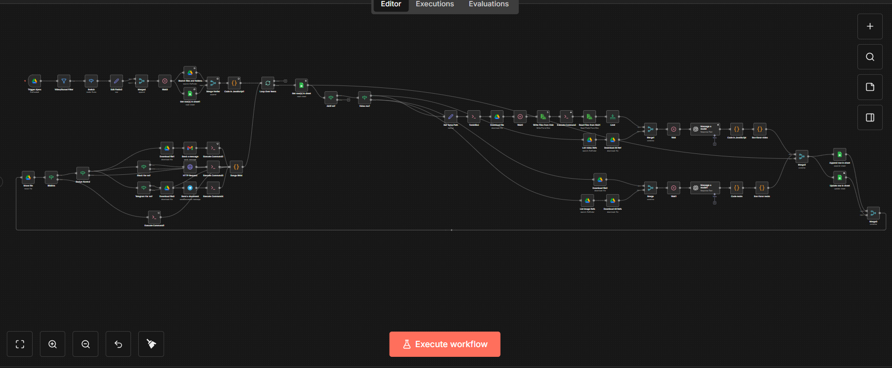
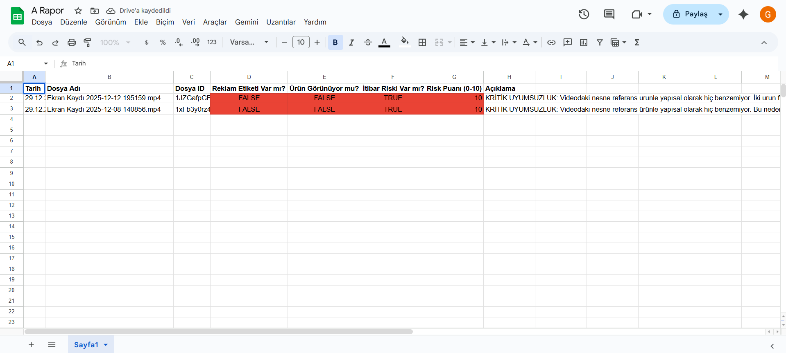

# 🛡️ Automated Ad Compliance Engine (SaaS Core)

**Dijital reklam denetim süreçlerini otomatize eden, ölçeklenebilir ve yapay zeka destekli bir SaaS altyapısı.**

## 🚀 Proje Özeti
Bu proje, manuel ve hataya açık reklam denetleme süreçlerini (görsel, metin ve politika ihlalleri) ortadan kaldırmak için geliştirilmiş kapalı kaynak (closed-source) bir otomasyon motorudur. Sistem, yüksek hacimli reklam verilerini işleyerek ajanslar ve markalar için gerçek zamanlı uygunluk raporları üretir.

## 🏗️ Mimari ve Teknoloji
Sistemin kalbinde, karmaşık iş mantıklarını yöneten gelişmiş bir **n8n** orkestrasyonu bulunur. Veri işleme ve çok kiracılı (multi-tenancy) kullanıcı yönetimi için arka planda **PHP** kullanılırken, gerçek zamanlı veri akışı **JavaScript** ile sağlanmaktadır.

### Temel Özellikler:
* **Akıllı Yönlendirme:** Reklam içeriğini analiz eder ve ilgili denetim katmanına otomatik olarak yönlendirir.
* **Çok Katmanlı Raporlama:** Sonuçlar anlık olarak Google Sheets, Slack veya özel webhook'lar üzerinden iletilir.
* **Ölçeklenebilir Yapı:** Başlangıç seviyesinden ajans seviyesine kadar farklı veri yüklerini kaldırabilecek modüler tasarım.

---
*Not: Bu proje ticari bir SaaS ürünü olduğu için kaynak kodları (n8n JSON akışları ve backend kodları) gizli tutulmaktadır. Aşağıdaki görseller sistemin mimarisi ve çıktıları hakkında fikir vermesi amacıyla paylaşılmıştır.*

## 📸 Sistem Görüntüleri

### 1. Sistemin Kuş Bakışı Mimarisi (n8n)
Karmaşık iş akışlarını ve karar mekanizmalarını yöneten ana motor.

### 2. Otomatik Denetim Çıktısı
Sistemin ürettiği gerçek zamanlı uygunluk raporu örneği.

